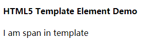
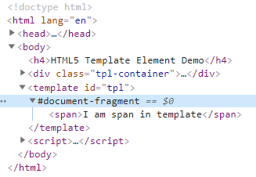
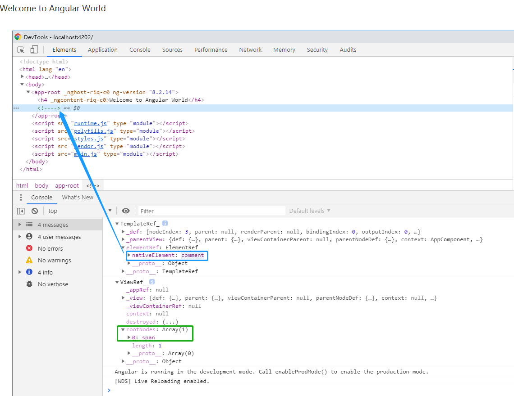
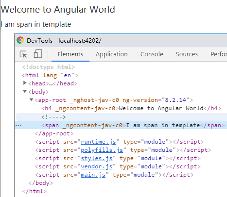
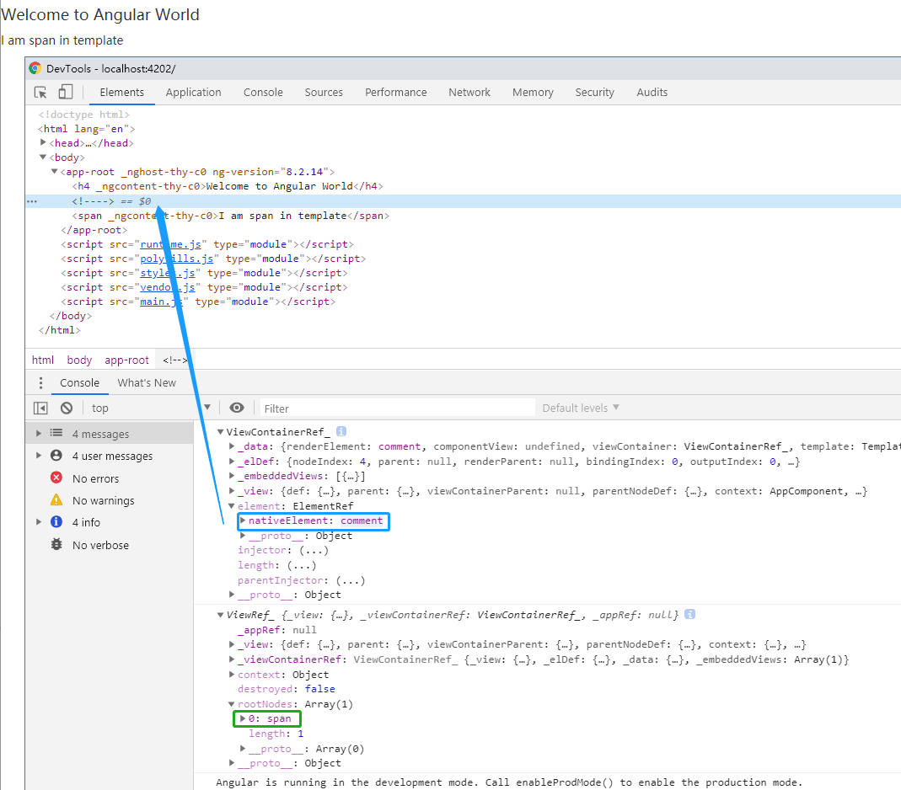

# Angular TemplateRef & ViewContainerRef

## HTML5 template

*learn-template.html*

```html
<!DOCTYPE html>
<html lang="en">
<head>
	<meta charset="UTF-8">
	<meta name="viewport" content="width=device-width, initial-scale=1.0">
	<meta http-equiv="X-UA-Compatible" content="ie=edge">
	<title>Document</title>
</head>
<body>
	<h4>HTML5 Template Element Demo</h4>
	<div class="tpl-container"></div>
	<template id="tpl">
		<span>I am span in template</span>
	</template>
</body>
</html>
<script>
	(function() {
		let tpl = document.querySelector('#tpl');
		let tplContainer = document.querySelector('.tpl-container');
		let tplNode = document.importNode(tpl.content, true);
		tplContainer.appendChild(tplNode);
	})();
</script>
```

 

 

## TemplateRef

### ng-template即commnet

*src\app\app.component.html*

```html
<h4>Welcome to Angular World</h4>
<ng-template #tpl>
  <span>I am span in template</span>
</ng-template>
```

*src\app\app.component.ts*

```typescript
import { Component, ViewChild, TemplateRef, AfterViewInit, ElementRef } from '@angular/core';

@Component({
  selector: 'app-root',
  templateUrl: './app.component.html',
  styleUrls: ['./app.component.scss']
})
export class AppComponent implements AfterViewInit {

  name = 'Darwin';

  @ViewChild('tpl', { static: false })
  tpl: TemplateRef<any>;

  ngAfterViewInit(): void {
    console.dir(this.tpl);
    const embeddedView = this.tpl.createEmbeddedView(null);
    console.dir(embeddedView);
  }
}
```



### 内嵌视图

`<ng-tempate>`模板元素，渲染后被替换成`commnet`。`TemplateRef`抽象类中定义的`createEmbeddedView`抽象方法，该方法返回值是`EmbeddedViewRef`对象。通过调用`createEmbeddedView`方法返回了`ViewRef_`视图对象。该视图对象的`rootNodes`属性包含了`<ng-template>`模板中的内容。由于`TemplateRef`实例对象中的`elementRef`属性封装了页面的`comment`元素，所以可以通过`insertBefore`方法创建模板定义的内容。

>`TemplateRef # createEmbeddedView(context: C): EmbeddedViewRef<C>;`中`context`相当于一个容器流上下文。

*src\app\app.component.ts*

```typescript
import { Component, ViewChild, TemplateRef, AfterViewInit, ElementRef } from '@angular/core';

@Component({
  selector: 'app-root',
  templateUrl: './app.component.html',
  styleUrls: ['./app.component.scss']
})
export class AppComponent implements AfterViewInit {

  name = 'Darwin';

  @ViewChild('tpl', { static: false })
  tpl: TemplateRef<any>;

  ngAfterViewInit(): void {
    console.dir(this.tpl);
    // 页面中的 commnet <!---->
    const commnetElement: HTMLElement = this.tpl.elementRef.nativeElement;
    // 内嵌视图
    const embeddedView = this.tpl.createEmbeddedView(null);
    embeddedView.rootNodes.forEach((node) => {
      // commnetElement.nextSibling：commnetElement 的 下一个元素
      commnetElement.parentNode.insertBefore(node, commnetElement.nextSibling);
    });
    console.dir(embeddedView);
  }
}
```

 

上面的处理步骤：

- 创建内嵌视图（embedded view）
- 遍历内嵌视图中的`rootNodes`，动态插入node

### 源码类

#### TemplateRef_

*node_modules\@angular\core\fesm2015\core.js*

```typescript
class TemplateRef_ extends TemplateRef {
    /**
     * @param {?} _parentView
     * @param {?} _def
     */
    constructor(_parentView, _def) {
        super();
        this._parentView = _parentView;
        this._def = _def;
    }
    /**
     * @param {?} context
     * @return {?}
     */
    createEmbeddedView(context) {
        return new ViewRef_(Services.createEmbeddedView(this._parentView, this._def, (/** @type {?} */ ((/** @type {?} */ (this._def.element)).template)), context));
    }
    /**
     * @return {?}
     */
    get elementRef() {
        return new ElementRef(asElementData(this._parentView, this._def.nodeIndex).renderElement);
    }
}
```

#### TemplateRef

*node_modules\@angular\core\core.d.ts*

```typescript
// 用于表示内嵌的 ng-template 模板，能够用于创建内嵌视图(Embedded Views)
export declare abstract class TemplateRef<C> {
    /**
     * The anchor element in the parent view for this embedded view.
     *
     * The data-binding and injection contexts of embedded views created from this `TemplateRef`
     * inherit from the contexts of this location.
     *
     * Typically new embedded views are attached to the view container of this location, but in
     * advanced use-cases, the view can be attached to a different container while keeping the
     * data-binding and injection context from the original location.
     *
     */
    abstract readonly elementRef: ElementRef;
    /**
     * Instantiates an embedded view based on this template,
     * and attaches it to the view container.
     * @param context The data-binding context of the embedded view, as declared
     * in the `<ng-template>` usage.
     * @returns The new embedded view object.
     */
    abstract createEmbeddedView(context: C): EmbeddedViewRef<C>;
}
```

#### ViewRef_

*node_modules\@angular\core\fesm2015\core.js*

```typescript
class ViewRef_ {
    /**
     * @param {?} _view
     */
    constructor(_view) {
        this._view = _view;
        this._viewContainerRef = null;
        this._appRef = null;
    }
    /**
     * @return {?}
     */
    get rootNodes() { return rootRenderNodes(this._view); }
    /**
     * @return {?}
     */
    get context() { return this._view.context; }
    /**
     * @return {?}
     */
    get destroyed() { return (this._view.state & 128 /* Destroyed */) !== 0; }
    /**
     * @return {?}
     */
    markForCheck() { markParentViewsForCheck(this._view); }
    /**
     * @return {?}
     */
    detach() { this._view.state &= ~4 /* Attached */; }
    /**
     * @return {?}
     */
    detectChanges() {
        /** @type {?} */
        const fs = this._view.root.rendererFactory;
        if (fs.begin) {
            fs.begin();
        }
        try {
            Services.checkAndUpdateView(this._view);
        }
        finally {
            if (fs.end) {
                fs.end();
            }
        }
    }
    /**
     * @return {?}
     */
    checkNoChanges() { Services.checkNoChangesView(this._view); }
    /**
     * @return {?}
     */
    reattach() { this._view.state |= 4 /* Attached */; }
    /**
     * @param {?} callback
     * @return {?}
     */
    onDestroy(callback) {
        if (!this._view.disposables) {
            this._view.disposables = [];
        }
        this._view.disposables.push((/** @type {?} */ (callback)));
    }
    /**
     * @return {?}
     */
    destroy() {
        if (this._appRef) {
            this._appRef.detachView(this);
        }
        else if (this._viewContainerRef) {
            this._viewContainerRef.detach(this._viewContainerRef.indexOf(this));
        }
        Services.destroyView(this._view);
    }
    /**
     * @return {?}
     */
    detachFromAppRef() {
        this._appRef = null;
        renderDetachView$1(this._view);
        Services.dirtyParentQueries(this._view);
    }
    /**
     * @param {?} appRef
     * @return {?}
     */
    attachToAppRef(appRef) {
        if (this._viewContainerRef) {
            throw new Error('This view is already attached to a ViewContainer!');
        }
        this._appRef = appRef;
    }
    /**
     * @param {?} vcRef
     * @return {?}
     */
    attachToViewContainerRef(vcRef) {
        if (this._appRef) {
            throw new Error('This view is already attached directly to the ApplicationRef!');
        }
        this._viewContainerRef = vcRef;
    }
}
```

#### EmbeddedViewRef

*node_modules\@angular\core\core.d.ts*

```typescript
export declare abstract class EmbeddedViewRef<C> extends ViewRef {
    /**
     * The context for this view, inherited from the anchor element.
     */
    abstract readonly context: C;
    /**
     * The root nodes for this embedded view.
     */
    abstract readonly rootNodes: any[];
}
```

#### ViewRef

*node_modules\@angular\core\core.d.ts*

```typescript
export declare abstract class ViewRef extends ChangeDetectorRef {
    /**
     * Destroys this view and all of the data structures associated with it.
     */
    abstract destroy(): void;
    /**
     * Reports whether this view has been destroyed.
     * @returns True after the `destroy()` method has been called, false otherwise.
     */
    abstract readonly destroyed: boolean;
    /**
     * A lifecycle hook that provides additional developer-defined cleanup
     * functionality for views.
     * @param callback A handler function that cleans up developer-defined data
     * associated with a view. Called when the `destroy()` method is invoked.
     */
    abstract onDestroy(callback: Function): any /** TODO #9100 */;
}
```

## ViewContainerRef

`ViewContainerRef`相当于视图容器，生成后属性

```
ViewContainerRef_ # element: ElementRef # nativeElement: comment
```

指向页面的 commet 元素，以此为根本创建内嵌视图。如下代码中，ViewContainerRef_ 的属性 length 开始为 0，调用`createEmbeddedView`方法后变为 1。

*src\app\app.component.ts*

```typescript
import { Component, ViewChild, TemplateRef, AfterViewInit, ElementRef, ViewContainerRef } from '@angular/core';

@Component({
  selector: 'app-root',
  templateUrl: './app.component.html',
  styleUrls: ['./app.component.scss']
})
export class AppComponent implements AfterViewInit {

  name = 'Darwin';

  @ViewChild('tpl', { static: false })
  tpl: TemplateRef<any>;

  @ViewChild('tpl', { read: ViewContainerRef, static: false })
  tplVcRef: ViewContainerRef;

  ngAfterViewInit(): void {
    console.dir(this.tplVcRef);
    // 创建内嵌视图
    const embeddedView = this.tplVcRef.createEmbeddedView(this.tpl);
    console.log(embeddedView);
  }
}
```



### 源码类

#### ViewContainerRef_

*node_modules\@angular\core\fesm2015\core.js*

```typescript
// 用于表示一个视图容器，可添加一个或多个视图
class ViewContainerRef_ {
    /**
     * @param {?} _view
     * @param {?} _elDef
     * @param {?} _data
     */
    constructor(_view, _elDef, _data) {
        this._view = _view;
        this._elDef = _elDef;
        this._data = _data;
        /**
         * \@internal
         */
        this._embeddedViews = [];
    }
    /**
     * @return {?}
     */
    get element() { return new ElementRef(this._data.renderElement); }
    /**
     * @return {?}
     */
    get injector() { return new Injector_(this._view, this._elDef); }
    /**
     * @deprecated No replacement
     * @return {?}
     */
    get parentInjector() {
        /** @type {?} */
        let view = this._view;
        /** @type {?} */
        let elDef = this._elDef.parent;
        while (!elDef && view) {
            elDef = viewParentEl(view);
            view = (/** @type {?} */ (view.parent));
        }
        return view ? new Injector_(view, elDef) : new Injector_(this._view, null);
    }
    /**
     * @return {?}
     */
    clear() {
        /** @type {?} */
        const len = this._embeddedViews.length;
        for (let i = len - 1; i >= 0; i--) {
            /** @type {?} */
            const view = (/** @type {?} */ (detachEmbeddedView(this._data, i)));
            Services.destroyView(view);
        }
    }
    /**
     * @param {?} index
     * @return {?}
     */
    get(index) {
        /** @type {?} */
        const view = this._embeddedViews[index];
        if (view) {
            /** @type {?} */
            const ref = new ViewRef_(view);
            ref.attachToViewContainerRef(this);
            return ref;
        }
        return null;
    }
    
    // 返回视图容器中已存在的视图个数
    /**
     * @return {?}
     */
    get length() { return this._embeddedViews.length; }
    
    // 基于TemplateRef创建内嵌视图，并自动添加到视图容器中，可通过index设置视图添加的位置
    /**
     * @template C
     * @param {?} templateRef
     * @param {?=} context
     * @param {?=} index
     * @return {?}
     */
    createEmbeddedView(templateRef, context, index) {
        /** @type {?} */
        const viewRef = templateRef.createEmbeddedView(context || (/** @type {?} */ ({})));
        this.insert(viewRef, index);
        return viewRef;
    }
    
    // 基 ComponentFactory 创建组件视图
    /**
     * @template C
     * @param {?} componentFactory
     * @param {?=} index
     * @param {?=} injector
     * @param {?=} projectableNodes
     * @param {?=} ngModuleRef
     * @return {?}
     */
    createComponent(componentFactory, index, injector, projectableNodes, ngModuleRef) {
        /** @type {?} */
        const contextInjector = injector || this.parentInjector;
        if (!ngModuleRef && !(componentFactory instanceof ComponentFactoryBoundToModule)) {
            ngModuleRef = contextInjector.get(NgModuleRef);
        }
        /** @type {?} */
        const componentRef = componentFactory.create(contextInjector, projectableNodes, undefined, ngModuleRef);
        this.insert(componentRef.hostView, index);
        return componentRef;
    }
    /**
     * @param {?} viewRef
     * @param {?=} index
     * @return {?}
     */
    insert(viewRef, index) {
        if (viewRef.destroyed) {
            throw new Error('Cannot insert a destroyed View in a ViewContainer!');
        }
        /** @type {?} */
        const viewRef_ = (/** @type {?} */ (viewRef));
        /** @type {?} */
        const viewData = viewRef_._view;
        attachEmbeddedView(this._view, this._data, index, viewData);
        viewRef_.attachToViewContainerRef(this);
        return viewRef;
    }
    /**
     * @param {?} viewRef
     * @param {?} currentIndex
     * @return {?}
     */
    move(viewRef, currentIndex) {
        if (viewRef.destroyed) {
            throw new Error('Cannot move a destroyed View in a ViewContainer!');
        }
        /** @type {?} */
        const previousIndex = this._embeddedViews.indexOf(viewRef._view);
        moveEmbeddedView(this._data, previousIndex, currentIndex);
        return viewRef;
    }
    /**
     * @param {?} viewRef
     * @return {?}
     */
    indexOf(viewRef) {
        return this._embeddedViews.indexOf(((/** @type {?} */ (viewRef)))._view);
    }
    /**
     * @param {?=} index
     * @return {?}
     */
    remove(index) {
        /** @type {?} */
        const viewData = detachEmbeddedView(this._data, index);
        if (viewData) {
            Services.destroyView(viewData);
        }
    }
    /**
     * @param {?=} index
     * @return {?}
     */
    detach(index) {
        /** @type {?} */
        const view = detachEmbeddedView(this._data, index);
        return view ? new ViewRef_(view) : null;
    }
}
```

## 总结

- **TemplateRef**：用于表示内嵌的 ng-template 模板元素，通过 TemplateRef 实例，我们可以方便创建内嵌视图(Embedded Views)，且可以轻松地访问到通过 ElementRef 封装后的 nativeElement。需要注意的是组件视图中的 ng-template 模板元素，经过渲染后会被替换成 comment 元素。
- **ViewContainerRef**：用于表示一个视图容器，可添加一个或多个视图。通过 ViewContainer
  Ref 实例，我们可以基于 TemplateRef 实例创建内嵌视图，并能指定内嵌视图的插入位置，也可以方便对视图容器中已有的视图进行管理。简而言之，ViewContainerRef 的主要作用是创建和管理内嵌视图或组件视图。

