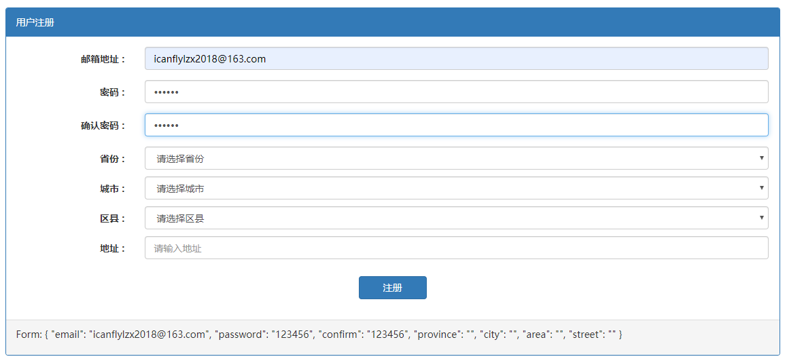
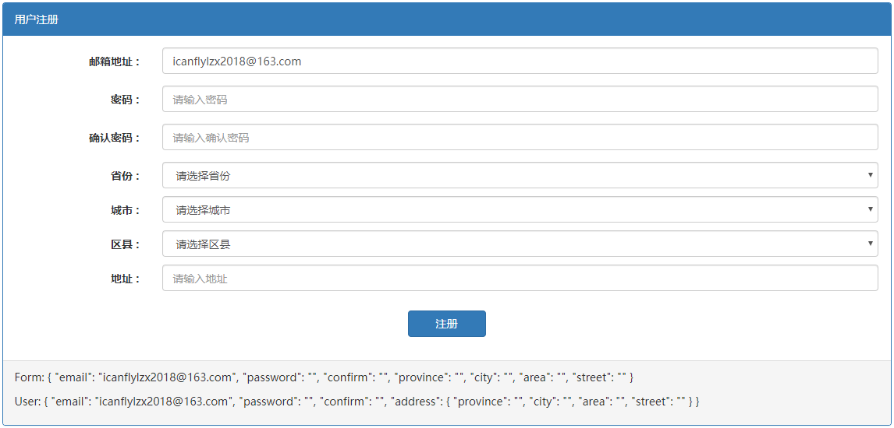
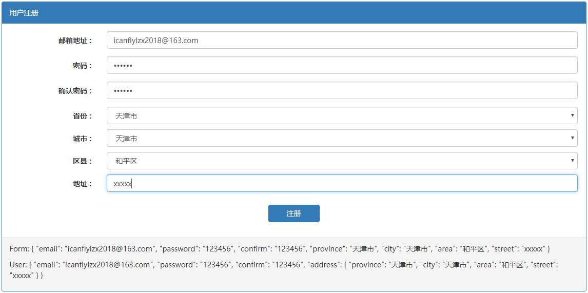
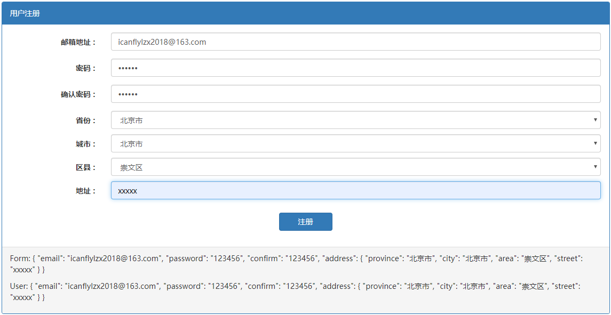
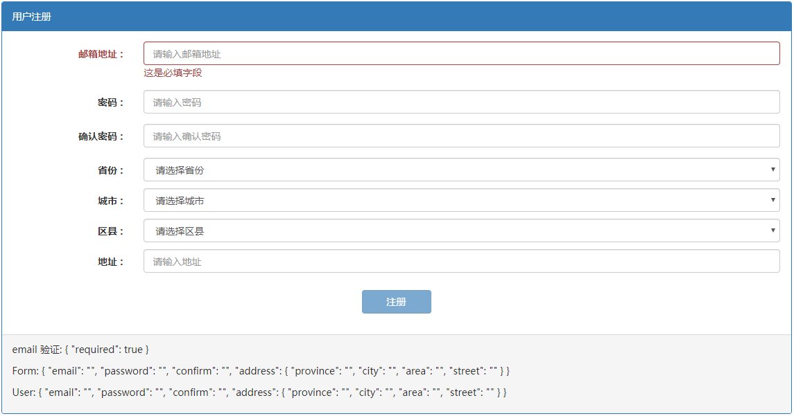
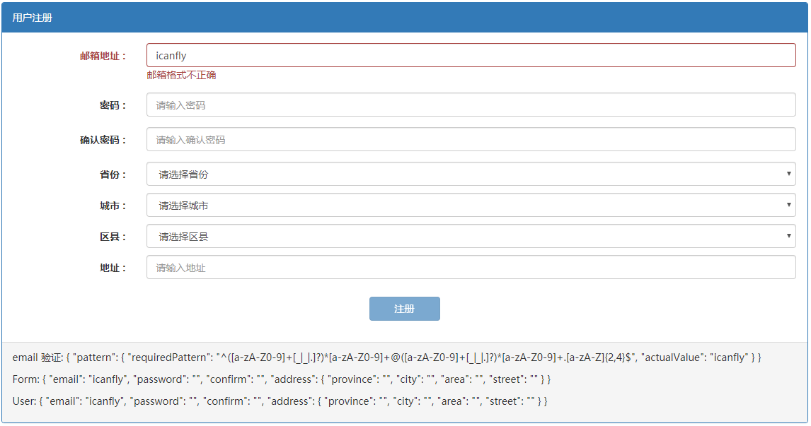
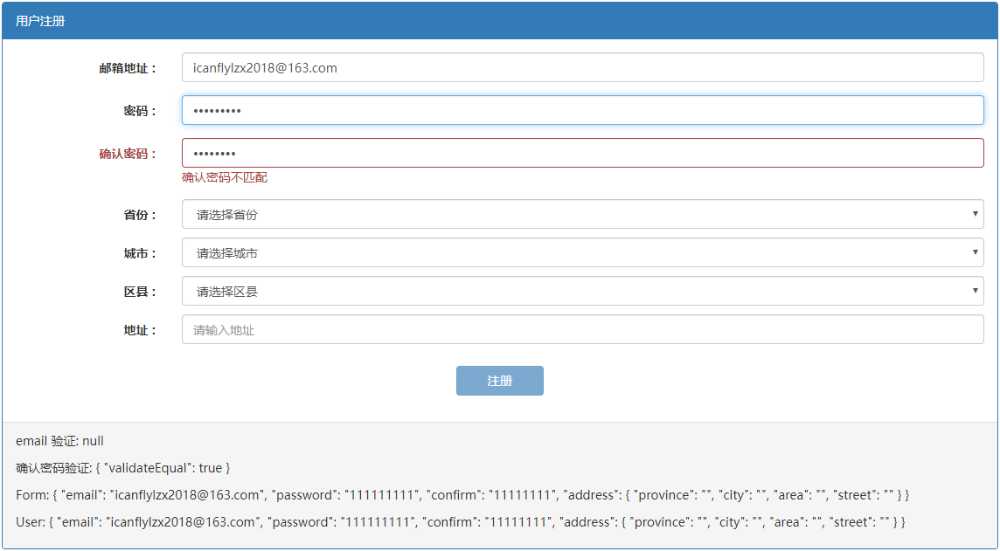

# 模板驱动型表单

Angular 中提供了 2 种类型的表单处理机制，一种叫模板驱动型（Template Driven）的表单，另一种叫模型驱动型表单（Model Driven），也叫响应式表单（Reactive Forms）。

对于模板驱动型的表单处理，首先在模块中引入 `FormsModule`，然后在组件中就可以使用 `ngModel` 进行绑定了。

## ngModel

在 Angular 中可以使用 3 种形式的 `ngModel` 表达式：

- `ngModel`
- `[ngModel]`
- `[(ngModel)]`

在 Angular 表单中使用 `ngModel` 需要注意，必须带有 `name` 属性或者使用 `[ngModelOptions]= "{ standalone: true }"`，二选一：

```html
<form #testform="ngform">
    <input name="username" [(ngModel)]=user.name />
</form> 

<form #testform="ngform">
    <input [ngModelOptions]="{standalone: true}" [(ngModel)]=user.name />
</form> 
```

因为 `ngForm` 持有通过 `ngModel` 指令和 `name` 属性为各个元素创建的控件，并监听它们的属性变化。它还有自己的 `valid` 属性，只有当其中所有控件都有效时，才有效。

> 如果忘记添加 `name` 属性的话，会出现如下错误：
>
> ```tsx
> ERROR Error: Uncaught (in promise): Error: If ngModel is used within a form tag, either the name attribute must be set or the form control must be defined as 'standalone' in ngModelOptions.
> ```

## ngModel 和 FormControl

如果使用的是 `ngModel`，没有任何中括号、小括号的话，这代表我们创建一个 FormControl 的实例，这个实例将会跟踪**值的变化**、**用户的交互**、**验证状态**以及**保持视图和领域对象的同步**等工作。

```html
<input ngModel type="email" name="email" placeholder="请输入邮箱地址">
```

如果将这个控件放在一个 Form 表单中，`ngModel` 会自动将这个 FormControl 注册为 Form 的子控件。

```html
<!-- ngForm 不需要显示声明，任何 <form> 标签默认都是：ngForm -->
<form novalidate ngForm>
  <input ngModel type="email" name="email" placeholder="请输入邮箱地址">
</form>
```

`<form>` 中添加了 `ngForm` 指令，这是声明一个 Angular 可识别的表单，而 `ngModel` 会将 `<input>` 注册成表单子控件，这个子控件的名字就是 `emain`（`name="email"`），而且 `ngModel` 会基于这个子控件的值去绑定表单的值，这就是为什么需要显示声明 `name` 的原因。

> 其实在导入 `FormsModule` 的时候，所有的 `<form>` 标签都会默认的被认为是一个 `ngForm`，因此我们并不需要显示的添加 `ngForm` 指令。

引用表单对象，使用 `#form="ngForm"` 输出表单的一些特性。

```html
<!-- 使用 # 把表单对象导出到 form 这个可引用变量中 -->
<form novalidate #form="ngForm"></form>
<!-- 将表单的值以 JSON 形式输出 -->
{{ form.value | json }}
```

*src\app\template-driven\template-driven.component.ts*

```html
<div class="panel panel-primary">
  <div class="panel-heading">用户注册</div>
  <div class="panel-body">
    <!-- novalidate 清除浏览器默认的校验行为 -->
    <form #form="ngForm" novalidate class="form-horizontal">
      <!-- 邮箱地址 -->
      <div class="form-group">
        <label class="col-xs-2 control-label">邮箱地址 :</label>
        <div class="col-xs-10">
          <input ngModel
                type="email" name="email" placeholder="请输入邮箱地址" class="form-control">
        </div>
      </div>
      <!-- 密码 -->
      <div class="form-group">
        <label class="col-xs-2 control-label">密码 :</label>
        <div class="col-xs-10">
          <input ngModel
                type="password" name="password" placeholder="请输入密码" class="form-control">
        </div>
      </div>
      <!-- 确认密码 -->
      <div class="form-group">
        <label class="col-xs-2 control-label">确认密码 :</label>
        <div class="col-xs-10">
          <input ngModel
                type="password" name="confirm" placeholder="请输入确认密码" class="form-control">
        </div>
      </div>
      <!-- 省市区地址 -->
      <div class="form-group">
        <label class="col-xs-2 control-label">省份 :</label>
        <div class="col-xs-10 limit">
          <select ngModel
                  name="province" class="form-control">
            <option value="">请选择省份</option>
          </select>
        </div>
        <label class="col-xs-2 control-label">城市 :</label>
        <div class="col-xs-10 limit">
          <select ngModel
                  name="city" class="form-control">
            <option value="">请选择城市</option>
          </select>
        </div>
        <label class="col-xs-2 control-label">区县 :</label>
        <div class="col-xs-10 limit">
          <select ngModel
                  name="area" class="form-control">
            <option value="">请选择区县</option>
          </select>
        </div>
        <label class="col-xs-2 control-label">地址 :</label>
        <div class="col-xs-10 limit">
          <input ngModel
                type="text" name="street" placeholder="请输入地址" class="form-control">
        </div>
      </div>
      <div class="form-group">
        <div class="col-xs-12" style="text-align: center;">
          <button type="submit" class="btn btn-primary" style="width: 100px;">注册</button>
        </div>
      </div>
    </form>
  </div>
  <div class="panel-footer">
    <p>Form: {{ form.value | json }}</p>
  </div>
</div>

```



## 单向数据绑定

如果想给控件设置一个初始值应该怎么办？这是就需要进行一个单向绑定，方向是从组件到视图。在模板中使用 `[ngModel]="user.email"` 进行单向绑定，这个语法和普通的属性绑定是一样的。

*src\app\template-driven\template-driven.component.html*

```html
<div class="form-group">
    <label class="col-xs-2 control-label">邮箱地址 :</label>
    <div class="col-xs-10">
        <input [ngModel]="user.email"
               type="email" name="email" placeholder="请输入邮箱地址" class="form-control">
    </div>
</div>
```

*src\app\template-driven\template-driven.component.ts*

```typescript
@Component({
  selector: 'app-template-driven',
  templateUrl: './template-driven.component.html',
  styleUrls: ['./template-driven.component.scss']
})
export class TemplateDrivenComponent implements OnInit {

  user: User = {
    email: 'icanflylzx2018@163.com', password: '', confirm: '',
    address: { province: '', city: '', area: '', street: '' }
  };
}
```



## 双向数据绑定

上述的单向数据绑定，在输入框进行输入的时候，`user` 的值是不会随之改变的。如果希望输入时的值也反向影响 `user` 对象的值的话，那就需要使用双向绑定，即 `[(ngModel)]`。

这个 `[()]` 表达式其实是一个语法糖，用这个语法糖使你不用既写数据绑定又写事件绑定了。下面的 2 种写法是等价的：

```html
<input [(ngModel)]="user.email">
<input [ngModel]="user.email" (ngModelChange)="user.email = $event">
```

*src\app\template-driven\template-driven.component.html*

```html
<br>
<div class="panel panel-primary">
  <div class="panel-heading">用户注册</div>
  <div class="panel-body">
    <!-- novalidate 清除浏览器默认的校验行为 -->
    <form #form="ngForm" novalidate class="form-horizontal">
      <!-- 邮箱地址 -->
      <div class="form-group">
        <label class="col-xs-2 control-label">邮箱地址 :</label>
        <div class="col-xs-10">
          <input [(ngModel)]="user.email"
                type="email" name="email" placeholder="请输入邮箱地址" class="form-control">
        </div>
      </div>
      <!-- 密码 -->
      <div class="form-group">
        <label class="col-xs-2 control-label">密码 :</label>
        <div class="col-xs-10">
          <input [(ngModel)]="user.password"
                type="password" name="password" placeholder="请输入密码" class="form-control">
        </div>
      </div>
      <!-- 确认密码 -->
      <div class="form-group">
        <label class="col-xs-2 control-label">确认密码 :</label>
        <div class="col-xs-10">
          <input [(ngModel)]="user.confirm"
                type="password" name="confirm" placeholder="请输入确认密码" class="form-control">
        </div>
      </div>
      <!-- 区域 -->
      <div class="form-group">
        <!-- 省份 -->
        <label class="col-xs-2 control-label">省份 :</label>
        <div class="col-xs-10 limit">
          <select [(ngModel)]="user.address.province"
                  (change)="onProvinceChange()"
                  name="province" class="form-control">
            <option value="">请选择省份</option>
            <option [value]="province" *ngFor="let province of provinces">{{ province }}</option>
          </select>
        </div>
        <!-- 城市 -->
        <label class="col-xs-2 control-label">城市 :</label>
        <div class="col-xs-10 limit">
          <select [(ngModel)]="user.address.city"
                  (change)="onCityChange()"
                  name="city" class="form-control">
            <option value="">请选择城市</option>
            <option [value]="city" *ngFor="let city of cities">{{ city }}</option>
          </select>
        </div>
        <!-- 区县 -->
        <label class="col-xs-2 control-label">区县 :</label>
        <div class="col-xs-10 limit">
          <select [(ngModel)]="user.address.area"
                  name="area" class="form-control">
            <option value="">请选择区县</option>
            <option [value]="area" *ngFor="let area of areas">{{ area }}</option>
          </select>
        </div>
        <!-- 地址 -->
        <label class="col-xs-2 control-label">地址 :</label>
        <div class="col-xs-10 limit">
          <input [(ngModel)]="user.address.street"
                type="text" name="street" placeholder="请输入地址" class="form-control">
        </div>
      </div>
      <!-- 提交按钮 -->
      <div class="form-group">
        <div class="col-xs-12" style="text-align: center;">
          <button type="submit" class="btn btn-primary" style="width: 100px;">注册</button>
        </div>
      </div>
    </form>
  </div>
  <!-- 数据显示 -->
  <div class="panel-footer">
    <p>Form: {{ form.value | json }}</p>
    <p>User: {{ user | json }}</p>
  </div>
</div>

```

*src\app\template-driven\template-driven.component.ts*

```typescript
@Component({
  selector: 'app-template-driven',
  templateUrl: './template-driven.component.html',
  styleUrls: ['./template-driven.component.scss']
})
export class TemplateDrivenComponent implements OnInit {

  user: User = {
    email: 'icanflylzx2018@163.com', password: '', confirm: '',
    address: { province: '', city: '', area: '', street: '' }
  };

  provinces = getProvinces();
  cities = [];
  areas = [];

  constructor() { }

  ngOnInit() {
  }


  // ----- Event / Change ----------------------------------------------------------------------------

  onProvinceChange() {
    const { address: { province }, address } = this.user;
    this.cities = getCitiesByProvince(province);
    this.areas = [];
    address.city = '';
    address.area = '';
  }

  onCityChange() {
    const { address, address: { province, city } } = this.user;
    this.areas = getAreasByCity(province, city);
    address.area = '';
  }
}
```



## ngModelGroup

仔细观察上面的输出，会发现一个问题：`user` 中有一个嵌套对象 `address`，而表单中是没有嵌套对象的，如果要实现表单中的结构和领域对象的结构一致的话，就需要 `ngModelGroup` 了。

`ngModelGroup` 会创建并绑定一个 FormGroup 到该 DOM 元素。FormGroup 是什么呢？简单来说，是一组 FormControl。

*src\app\template-driven\template-driven.component.html*

```html
<!-- 区域 -->
<div ngModelGroup="address" class="form-group">
    <!-- 省份 -->
    <label class="col-xs-2 control-label">省份 :</label>
    <div class="col-xs-10 limit">
        <select [(ngModel)]="user.address.province"
                (change)="onProvinceChange()"
                name="province" class="form-control">
            <option value="">请选择省份</option>
            <option [value]="province" *ngFor="let province of provinces">{{ province }}</option>
        </select>
    </div>
    ...
</div>
```



## 数据验证

模板驱动型的表单的验证也是主要由模板来处理的，下面确定一下验证规则：

- 必填项：`email`、`password` 和 `confirm`；
- `email` 的形式需要符合电子邮件的标准；
- `password` 和 `confirm` 必须一致。

除了这几个规则，我们还希望在表单未验证通过时提交按钮不可用。

*src\app\template-driven\template-driven.component.html*

```html
<br>
<div class="panel panel-primary">
  <div class="panel-heading">用户注册</div>
  <div class="panel-body">
    <!-- novalidate 清除浏览器默认的校验行为 -->
    <form #form="ngForm" novalidate class="form-horizontal">
      <!-- 邮箱地址 -->
      <div class="form-group" [ngClass]="{'has-error': email.invalid && email.touched }">
        <label class="col-xs-2 control-label">邮箱地址 :</label>
        <div class="col-xs-10">
          <input [(ngModel)]="user.email"
                #email="ngModel"
                required
                pattern="([a-zA-Z0-9]+[_|_|.]?)*[a-zA-Z0-9]+@([a-zA-Z0-9]+[_|_|.]?)*[a-zA-Z0-9]+.[a-zA-Z]{2,4}"
                type="email" name="email" placeholder="请输入邮箱地址" class="form-control">
          <div *ngIf="email.errors?.required && email.touched" class="text-danger">
            这是必填字段
          </div>
          <div *ngIf="email.errors?.pattern && email.touched" class="text-danger">
            邮箱格式不正确
          </div>
        </div>
      </div>
      <!-- 密码 -->
      <div class="form-group" [ngClass]="{'has-error': password.invalid && password.touched }">
        <label class="col-xs-2 control-label">密码 :</label>
        <div class="col-xs-10">
          <input [(ngModel)]="user.password"
                #password="ngModel"
                required
                minlength="8"
                validateEqual="confirm"
                reverse="true"
                type="password" name="password" placeholder="请输入密码" class="form-control">
          <div *ngIf="password.errors?.required && password.touched" class="text-danger">
            这是必填字段
          </div>
          <div *ngIf="password.errors?.minlength && password.touched" class="text-danger">
            最少要输入 8 个字符
          </div>
        </div>
      </div>
      <!-- 确认密码 -->
      <div class="form-group" [ngClass]="{'has-error': confirm.invalid && confirm.touched }">
        <label class="col-xs-2 control-label">确认密码 :</label>
        <div class="col-xs-10">
          <input [(ngModel)]="user.confirm"
                #confirm="ngModel"
                required
                minlength="8"
                validateEqual="password"
                type="password" name="confirm" placeholder="请输入确认密码" class="form-control">
          <div *ngIf="confirm.errors?.required && confirm.touched" class="text-danger">
            这是必填字段
          </div>
          <div *ngIf="confirm.errors?.minlength && confirm.touched" class="text-danger">
            最少要输入 8 个字符
          </div>
          <div *ngIf="confirm.errors?.validateEqual && confirm.touched" class="text-danger">
            确认密码不匹配
          </div>
        </div>
      </div>
      <!-- 区域 -->
      ...
      <!-- 提交按钮 -->
      <div class="form-group">
        <div class="col-xs-12" style="text-align: center;">
          <button type="submit" class="btn btn-primary" style="width: 100px;" 
                  [disabled]="form.invalid">注册</button>
        </div>
      </div>
    </form>
  </div>
  <!-- 数据显示 -->
  <div class="panel-footer">
    <p>email 验证: {{ form.controls.email?.errors | json }}</p>
    <p>Form: {{ form.value | json }}</p>
    <p>User: {{ user | json }}</p>
  </div>
</div>

```

Angular 中有几种内建支持的验证器（Validators）：

- required：需要 FormControl 有非空值
- minlength：需要 FormControl 有最小长度的值
- maxlength：需要 FormControl 有最大长度的值
- pattern：需要 FormControl 的值可以匹配正则表达式

如果不填邮箱地址的话，错误的 JSON 是 `{ "required": true }`，这告诉我们目前有一个 `required` 的规则没有被满足。



当输入 `icanfly`之后，就会发现错误变成下面的样子，这是因为我们对于 `email` 应用了多个规则，当必填项满足后，系统会继续检查其他验证结果。



通过多次试验，得出结论：

- 验证未通过：验证器返回的是一个对象，key 为验证的规则（比如：required、minlength等），value 为验证结果。
- 验证通过：返回一个 `null`

了解这一点后，就可以作出验证错误的提示了，为了方便引用，还可以导出 `ngModel` 到一个 `email` 引用，然后就可以访问这个 FormControl 的各个属性了：

- 验证状态：valid、invalid
- 控件状态：
  - 是否获得过焦点：touched、untouched
  - 是否更改过内容：pristine、dirty

## 自定义验证

内建的验证器对于 2 个密码比较验证是不够用的，这就需要我们自己定义一个验证器。对于响应式表单来说，会比较简单一些，但对于模板驱动的表单，这需要我们实现一个指令来使这个验证器更通用和更一致。

*src\app\template-driven\template-driven.component.html*

```html
<!-- 密码 -->
<input [(ngModel)]="user.password"
       #password="ngModel"
       required
       minlength="8"
       validateEqual="confirm"
       reverse="true"
       type="password" name="password" placeholder="请输入密码" class="form-control">

<!-- 确认密码 -->
<input [(ngModel)]="user.confirm"
       #confirm="ngModel"
       required
       minlength="8"
       validateEqual="password"
       type="password" name="confirm" placeholder="请输入确认密码" class="form-control">
```

要实现这种形式的验证，我们需要建立一个指令，这个指令应该实现 `validator` 接口。

*src\app\directives\confirm-validator.directive.ts*

```typescript
import { Directive, forwardRef } from '@angular/core';
import { NG_VALIDATORS, Validator, AbstractControl, ValidationErrors } from '@angular/forms';

@Directive({
  // tslint:disable-next-line:directive-selector
  selector: '[validateEqual][ngModel]',
  providers: [
    {
      provide: NG_VALIDATORS,
      useExisting: forwardRef(() => ConfirmValidatorDirective),
      multi: true
    }
  ]
})
export class ConfirmValidatorDirective implements Validator {

  constructor() { }

  validate(control: AbstractControl): ValidationErrors | null {
    return;
  }
}

```

- Validator 接口要求必须实现的一个方法是 `validate(control: AbstractControl): ValidationErrors | null`。这个就是前面提到的验证正确返回 `null` 否则返回一个对象，虽然没有严格的约束，但其 key 一般用于表示这个验证器的名字或验证规则的名字，value 一般是失败的原因或验证结果。
- 和组件类似，指令也有 `selector` 这个元数据，用于选择那个元素应用该指令，那么我们这个除了要求 DOM 元素应用 `validateEqual`之外，还需要它是一个 `ngModel` 元素，这样它才是一个 FormControl，在 validate 的时候才是合法的。
- `providers` 里的项是干什么的呢？Angular 对于在一个 FormControl 上执行验证器有一个内部机制：Angular 维护一个令牌为 `NG_VALIDATORS` 的 `multi provider`（简单说，Angular 为一个单一令牌注入多个值的这种形式叫 `multi provider`）。所以有的内建验证器都是加到这个 `NG_VALIDATORS` 的令牌上的，因此在做验证时，Angular 是注入 `NG_VALIDATORS` 的依赖，也就是所有的验证器，然后一个个的按顺序执行。因此我们这里也把自己加到这个 `NG_VALIDATORS` 中去。
- 如果我们直接写成 `useExisting: ConfirmValidatorDirective ` 会出现一个问题，`ConfirmValidatorDirective ` 还没有生成，你怎么能在元数据中使用呢？这就需要使用 `forwardRef` 来解决这个问题，它接受一个返回一个类的函数作为参数，但这个函数不会立即被调用，而是在该类声明后被调用，也就是避免了 `undefined` 的状态。

下面来验证逻辑，由于密码和确认密码有主从关系，并非完全的平行关系。也就是说，密码是一个基准对象，当密码改变时，不应该提示密码和确认密码不符，而是应该将错误放在确认密码中。所以给出另一个属性 `reverse`。

*src\app\directives\confirm-validator.directive.ts*

```typescript
 => ConfirmValidatorDirective),
      multi: true
    }
  ]
})
export class ConfirmValidatorDirective implements Validator {

  constructor(
    @Attribute('validateEqual') private validateEqual: string,
    @Attribute('reverse') private reverse: string
  ) { }

  validate(control: AbstractControl): ValidationErrors | null {
    // 当前控件值
    const currentValue = control.value;
    // 对比控件
    const targetControl = control.root.get(this.validateEqual);

    // 值不相等且不反向查询
    if (currentValue !== targetControl.value && !this.isReverse) {
      return { validateEqual: true };
    }

    // 值相等且反向查询
    if (currentValue === targetControl.value && this.isReverse) {
      targetControl.setErrors(null);
    }

    // 值相不等且反向查询
    if (currentValue !== targetControl.value && this.isReverse) {
      targetControl.setErrors({ validateEqual: true });
    }
    return null;
  }


  private get isReverse() {
    if (!this.reverse) {
      return false;
    }
    return this.reverse === 'true' ? true : false;
  }
}

```



## 表单提交

表单提交比较简单，绑定表单的 `ngSubmit` 事件即可：

```html
<form #form="ngForm" (ngSubmit)="onSubmit(form, $event)" novalidate class="form-horizontal">
</form>
```

button 如果不指定类型的话，会被当做 `type="submit"`，所以当按钮不进行提交表单的话，需要显式指定 `type="button"`。如果遇到点击按钮页面刷新的情况，意味着默认的表单提交事件引起了浏览器的刷新，这种时候需要阻止事件冒泡。

```typescript
onSubmit({value, valid}, event: Event) {
    if (valid) {
      console.log(value);
    }
    event.preventDefault();
}
```

