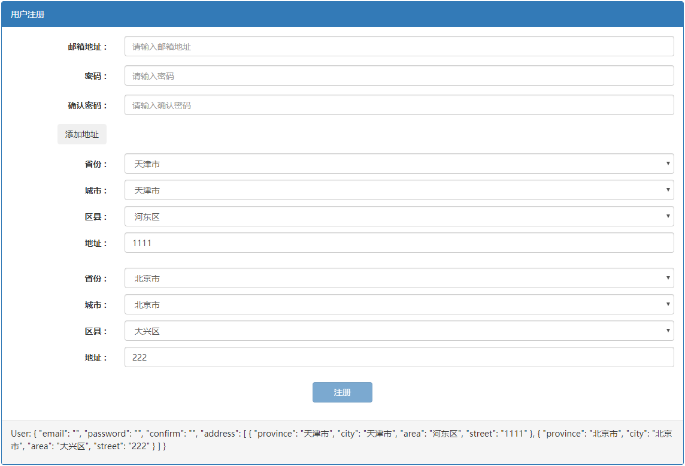

# 响应式表单

响应式表单乍一看很像模板驱动型表单（Template Driven），但响应式表单需要引入一个不同的模块：`ReactiveFormsModule` 而不是 `FormsModule`。

## 与模板驱动型表单的区别

利用之前的例子，用响应式表单的要求改写一下：

```html
<div class="panel panel-primary">
  <div class="panel-heading">用户注册</div>
  <div class="panel-body">
    <!-- novalidate 清除浏览器默认的校验行为 -->
    <form [formGroup]="user" (ngSubmit)="onSubmit(user, $event)" novalidate class="form-horizontal">
      <!-- 邮箱地址 -->
      <div class="form-group" 
           [ngClass]="{'has-error': user.get('email').invalid && user.get('email').touched }">
        <label class="col-xs-2 control-label">邮箱地址 :</label>
        <div class="col-xs-10">
          <input formControlName="email"
                  type="email" name="email" placeholder="请输入邮箱地址" class="form-control">
          <div *ngIf="user.get('email').hasError('required') && user.get('email').touched" 
               class="text-danger">
            这是必填字段
          </div>
          <div *ngIf="user.get('email').hasError('email') && user.get('email').touched" 
               class="text-danger">
            邮箱格式不正确
          </div>
        </div>
      </div>
      <!-- 密码 -->
      <div class="form-group" 
           [ngClass]="{'has-error': user.get('password').invalid && user.get('password').touched }">
        <label class="col-xs-2 control-label">密码 :</label>
        <div class="col-xs-10">
          <input formControlName="password"
                  type="password" name="password" placeholder="请输入密码" class="form-control">
          <div *ngIf="user.get('password').hasError('required') && user.get('password').touched"
               class="text-danger">
            这是必填字段
          </div>
          <div *ngIf="user.get('password').hasError('minlength') && user.get('password').touched"
               class="text-danger">
            最少要输入 8 个字符
          </div>
        </div>
      </div>
      <!-- 确认密码 -->
      <div class="form-group" [ngClass]="{'has-error': user.get('confirm').invalid && user.get('confirm').touched }">
        <label class="col-xs-2 control-label">确认密码 :</label>
        <div class="col-xs-10">
          <input formControlName="confirm"
                  type="password" name="confirm" placeholder="请输入确认密码" class="form-control">
          <div *ngIf="user.get('confirm').hasError('required') && user.get('confirm').touched"
               class="text-danger">
            这是必填字段
          </div>
          <div *ngIf="user.get('confirm').hasError('minlength') && user.get('confirm').touched"
               class="text-danger">
            最少要输入 8 个字符
          </div>
          <div *ngIf="user.hasError('validateEqual') && user.get('confirm').touched"
               class="text-danger">
            确认密码不匹配
          </div>
        </div>
      </div>

      <!-- 提交按钮 -->
      <div class="form-group">
        <div class="col-xs-12" style="text-align: center;">
          <button class="btn btn-primary" style="width: 100px;" [disabled]="user.invalid">注册</button>
        </div>
      </div>
    </form>
  </div>
  <!-- 数据显示 -->
  <div class="panel-footer">
    <p>User: {{ user.value | json }}</p>
  </div>
</div>

```

这段代码和模板驱动型表单的那段看起来差不多，但是有几个区别：

- 表单多了一个指令：`[formGroup]="user"`
- 去掉了对表单的引用：`#form="ngForm"`
- 每个控件多了一个 `formControlName`
- 但同时每个控件也去掉了验证条件，比如 `required`、`minlength`等
- 在地址分组中用 `formControlName="address"` 替代了 `ngModelGroup="address"`

接下来我们来看看组件的区别：

```typescript
@Component({
  selector: 'app-reactive-forms',
  templateUrl: './reactive-forms.component.html',
  styleUrls: ['./reactive-forms.component.scss']
})
export class ReactiveFormsComponent implements OnInit {

  user: FormGroup;

  constructor() { }

  ngOnInit() {
    // 初始化表单
    this.user = new FormGroup({
      email: new FormControl('', [
        Validators.required,
        Validators.pattern(/([a-zA-Z0-9]+[_|_|.]?)*[a-zA-Z0-9]+@([a-zA-Z0-9]+[_|_|.]?)*[a-zA-Z0-9]+.[a-zA-Z]{2,4}/)
      ]),
      password: new FormControl('', [Validators.required]),
      confirm: new FormControl('', [Validators.required]),
      address: new FormGroup({
        province: new FormControl(''),
        city: new FormControl(''),
        area: new FormControl(''),
        street: new FormControl('')
      })
    });
  }

  onSubmit(user: FormGroup, event: Event) {
    console.log(user);
    console.log(event);
  }
}

```

从上面的代码可以看出，这里的表单（`FormGroup`）是由一系列的表单控件（`FormControl`）构成的。其实 `FormGroup` 的构造函数接受的是三个参数：

- `controls`：表单控件『数组』，其实不是数组，是一个类似字典的对象
- `validator`：验证器
- `asyncValidator`：异步验证器

其中只有 `controls` 数组是必须的参数，后两个是可选参数。

```typescript
export declare class FormGroup extends AbstractControl {
    constructor(
		controls: { [key: string]: AbstractControl; }, 
         validatorOrOpts?:  ValidatorFn | ValidatorFn[] | AbstractControlOptions | null, 
         asyncValidator?: AsyncValidatorFn | AsyncValidatorFn[] | null
        );
}
```

上面的代码中没有使用验证器和异步验证器的可选参数，而且注意到我们提供 `controls` 的方式是，一个 `key` 对应一个 `FormControl`。比如下面的 `key` 是 `password`，对应的值是 `new FormControl('', [Validators.required])`。这个 `key` 对应的就是模板中的 `formControlName` 的值，我们模板代码设置了 `formControlName="password"`，而表单控件会根据这个 `password` 的控件名来跟踪实际的渲染出的表单页面上的控件（比如：`<input formControlName="password">`）的值和验证状态。

```typescript
password: new FormControl('', [Validators.required])
```

可以看出，这个表单控件的构造函数同样接受 3 个**可选**参数：

- `formState`：控件初始值
- `validator`：控件验证器或验证器数组
- `asyncValidator`：控件异步验证器或异步验证器数组

上面代码中，初始值为空字符串，验证器是是『必选』，而异步验证器没有提供。

```typescript
export declare class FormControl extends AbstractControl {
    constructor(
    	formState?: any, 
         validatorOrOpts?: ValidatorFn | ValidatorFn[] | AbstractControlOptions | null,
         asyncValidator?: AsyncValidatorFn | AsyncValidatorFn[] | null);
}
```

由此可以看出，响应式表单区别于模板驱动型表单主要在于：是由组件类去创建、维护和跟踪表单的变化，而不是依赖模板。

那么是否可以在响应式表单中使用 `ngModel` 呢？当然可以！但这样的话表单的值会在 2 个不同的位置存储：

- `ngModel` 绑定的对象
- `FormGroup`

这个在设计上我们一般是要避免的！

## FormBuilder 快速构建表单

Angular 提供了一种快捷构造表单的方式 —— 使用 FormBuilder。

```typescript
import { Component, OnInit } from '@angular/core';
import { FormGroup, FormControl, Validators, FormBuilder } from '@angular/forms';

@Component({
  selector: 'app-reactive-forms',
  templateUrl: './reactive-forms.component.html',
  styleUrls: ['./reactive-forms.component.scss']
})
export class ReactiveFormsComponent implements OnInit {

  user: FormGroup;

  constructor(private formBuilder: FormBuilder) { }

  ngOnInit() {
    // FormBuilder 初始化表单
    this.user = this.formBuilder.group({
      email: ['', [Validators.required, Validators.email]],
      password: ['', Validators.required],
      confirm: ['', Validators.required],
      address: this.formBuilder.group({
        province: [],
        city: [],
        area: [],
        street: []
      })
    });
  }

  onSubmit(user: FormGroup, event: Event) {
    console.log(user);
    console.log(event);
  }
}

```

使用 FormBuilder 可以无需显式声明 FormControl 或 FormGroup。FormBuilder 提供 3 种类型的快速构造：`control`、`group` 和 `array`，分别对应 FormControl、FormGroup 和 FormArray。

```typescript
export declare class FormBuilder {
	group(
    	controlsConfig: { [key: string]: any; }, 
    	options?: AbstractControlOptions | { [key: string]: any; } | null
        ): FormGroup;
}
```

在表单中最常见的一种是通过 `group` 来初始化整个表单。上面的例子中，我们可以看到 `group` 接受一个字典对象作为参数，这个字典中的 key 就是这个 FormGroup 中 FormControl 的名字，值是一个数组：

- 第一个值是控件的初始值；
- 第二个值是同步验证器的数组；
- 第三个值是异步验证器数组（例子中未出现）。

这其实是隐性的使用 `FormBuilder.control`，下面的 FormBuilder 中的 `control` 函数定义，其实 FormBuilder 利用我们给出的值构造了相对应的 `control`：

```typescript
export declare class FormBuilder {
	control(
    	formState: any, 
         validatorOrOpts?: ValidatorFn | ValidatorFn[] | AbstractControlOptions | null,
         asyncValidator?: AsyncValidatorFn | AsyncValidatorFn[] | null
        ): FormControl;    
}

```

此外还值得注意的有点是 address 的处理，FormBuilder 支持嵌套，遇到 FormGroup 时仅仅需要再次使用 `this.formBuilder.group({...})` 即可。

## 自定义验证

对于响应式表单来说，构造一个自定义验证器是非常简单的，比如上面的 `密码` 和 `确认密码` 是否相同的需求。

*src\app\reactive-forms\reactive-forms.component.ts*

```typescript
@Component({
  selector: 'app-reactive-forms',
  templateUrl: './reactive-forms.component.html',
  styleUrls: ['./reactive-forms.component.scss']
})
export class ReactiveFormsComponent implements OnInit {
    ...
    validateEqual(passwordKey: string, confirmKey: string): ValidatorFn {
		return (group: FormGroup): ValidationErrors | null => {
			const password = group.controls[passwordKey];
			const confirm = group.controls[confirmKey];
			if (password.value !== confirm.value) {
				return { validateEqual: true };
			}
			return null;
		};
	}
}
```

我们接受 2 个字符串（FormControl 的名字），返回一个 `ValidatorFn`。

```typescript
export declare interface ValidatorFn {
    (control: AbstractControl): ValidationErrors | null;
}
```

`ValidatorFn` 是一个对象定义，这个对象中有一个方法，此方法接受一个 `AbstractControl` 类型的参数（FormControl 继承自 AbstractControl 类），并且返回 `ValidationErrors`。

```typescript
export declare type ValidationErrors = {
    [key: string]: any;
};
```

然后就要使用这个自定义验证了：

*src\app\reactive-forms\reactive-forms.component.ts*

```typescript
import { Component, OnInit } from '@angular/core';
import { FormGroup, FormControl, Validators, FormBuilder, ValidatorFn, ValidationErrors, AbstractControl } from '@angular/forms';

@Component({
  selector: 'app-reactive-forms',
  templateUrl: './reactive-forms.component.html',
  styleUrls: ['./reactive-forms.component.scss']
})
export class ReactiveFormsComponent implements OnInit {

  user: FormGroup;

  constructor(private formBuilder: FormBuilder) { }

  ngOnInit() {
    // FormBuilder 初始化表单
    this.user = this.formBuilder.group({
      email: ['', [Validators.required, Validators.email]],
      password: ['', [Validators.required, Validators.minLength(8)]],
      confirm: ['', [Validators.required, Validators.minLength(8)]],
      address: this.formBuilder.group({
        province: [],
        city: [],
        area: [],
        street: []
      })
    }, {// 自定义验证
      validators: this.validateEqual('password', 'confirm')
    });
  }


  validateEqual(passwordKey: string, confirmKey: string): ValidatorFn {
    return (group: FormGroup): ValidationErrors | null => {
      const password = group.controls[passwordKey];
      const confirm = group.controls[confirmKey];
      if (password.value !== confirm.value) {
        return { validateEqual: true };
      }
      return null;
    };
  }
}

```

FormBuilder 的 `group` 函数接受 2 个参数：

- `controlsConfig`：用于表单控件的构造，以及每个表单控件的验证器。
- `options`：如果一个验证器要计算多个 `field` 的话，可以将其作为整个 `group` 的验证器。所以该参数可以提供同步验证器和异步验证器。同样还是一个字段对象，`key` 写成：
  - `validators`：同步验证器
  - `asyncValidators`：异步验证器

## FormArray

我们在购物网站经常遇到需要维护多个地址，这就是一个典型的 FormArray 的应用场景。所有地址的结构都是一样的，有省、市、区县和街道地址，处理这样的场景，响应式表单怎么做呢？

*src\app\reactive-forms\reactive-forms.component.html*

```html
<!-- 区域 -->
<div formArrayName="address">
    <div [formGroupName]="i" *ngFor="let item of user.controls.address['controls']; let i = index;"
         class="form-group">
        <!-- 省份 -->
        <label class="col-xs-2 control-label">省份 :</label>
        <div class="col-xs-10 limit">
            <select formControlName="province" class="form-control">
                <option value="">请选择省份</option>
                <option [value]="province" *ngFor="let province of provinces">{{ province }}</option>
            </select>
        </div>
        <!-- 城市 -->
        <label class="col-xs-2 control-label">城市 :</label>
        <div class="col-xs-10 limit">
            <select formControlName="city" class="form-control">
                <option value="">请选择城市</option>
                <option [value]="city" *ngFor="let city of cities$[i] | async">{{ city }}</option>
            </select>
        </div>
        <!-- 区县 -->
        <label class="col-xs-2 control-label">区县 :</label>
        <div class="col-xs-10 limit">
            <select formControlName="area" class="form-control">
                <option value="">请选择区县</option>
                <option [value]="area" *ngFor="let area of areas$[i] | async">{{ area }}</option>
            </select>
        </div>
        <!-- 地址 -->
        <label class="col-xs-2 control-label">地址 :</label>
        <div class="col-xs-10 limit">
            <input formControlName="street"
                   type="text" placeholder="请输入地址" class="form-control">
        </div>
    </div>
</div>
```

首先，改造一下地址多了，需要在原来的地址部分外面再套一层，并且声明成 `formArrayName="address"`。FormArray  顾名思义是一个数组，所以我们要对这个控件数组做一个循环，然后让每个数组元素是 FormGroup，只不过这次我们的 `[formGroupName]="i"` 是让 `formGroupName` 等于该数组元素的索引。

改造好模板后，对组件文件进行对应处理：

*src\app\reactive-forms\reactive-forms.component.ts*

```typescript
@Component({
  selector: 'app-reactive-forms',
  templateUrl: './reactive-forms.component.html',
  styleUrls: ['./reactive-forms.component.scss']
})
export class ReactiveFormsComponent implements OnInit {

  user: FormGroup;
  provinces: string[];
  cities$: Observable<string[]>[] = [];
  areas$: Observable<string[]>[] = [];

  constructor(private formBuilder: FormBuilder) { }

  ngOnInit() {
    // FormBuilder 初始化表单
    this.user = this.formBuilder.group({
      email: ['', [Validators.required, Validators.email]],
      password: ['', [Validators.required, Validators.minLength(8)]],
      confirm: ['', [Validators.required, Validators.minLength(8)]],
      /* address: this.formBuilder.group({
        province: [],
        city: [],
        area: [],
        street: []
      }) */
      address: this.formBuilder.array([])
    }, {// 自定义验证
      validators: this.validateEqual('password', 'confirm')
    });

    this.provinces = getProvinces();
  }

  addAddress() {
    (this.user.controls.address as FormArray).push(this.createAddress());
  }

  private createAddress() {
    const group = this.formBuilder.group({
      province: [],
      city: [],
      area: [],
      street: []
    });
    const provinceChanges = group.get('province').valueChanges;
    const cityChanges = group.get('city').valueChanges;

    const city$ = provinceChanges.pipe(mergeMap(province => of(getCitiesByProvince(province))));
    const area$ = combineLatest(
        provinceChanges, cityChanges, (province, city) => ({ province, city })
    ).pipe(
      mergeMap(({ province, city }) => of(getAreasByCity(province, city)))
    );

    this.cities$.push(city$);
    this.areas$.push(area$);

    return group;
  }
}
```



## 响应式表单的优势

首先是可测试能力。模板驱动型表单进行单元测试是比较困难的，因为验证逻辑是写在模板中的。但验证器的逻辑单元测试对于响应式表单来说就非常简单了，因为验证器无非就是一个函数而已。

除了这个优点，对表单可以有完全的掌控：从初始化表单控件的值、更新和获取表单值的变化到表单的验证和提交，这一系列的流程都在程序逻辑控制之下。

而且更重要的是，我们可以使用函数响应式编程的风格来处理各种表单操作，因为响应式表单提供了一系列支持 `Observable` 的接口API。