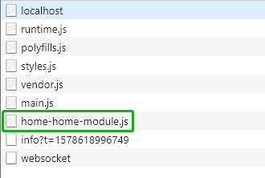
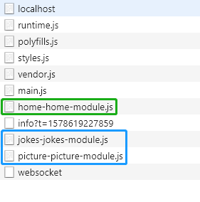
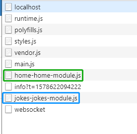

# 模块预加载

## 预加载策略

*首页无预加载*

 

  => import('./home/home.module').then(m => m.HomeModule) },
  { path: 'jokes', loadChildren: () => import('./jokes/jokes.module').then(m => m.JokesModule) },
  { path: 'picture', loadChildren: () => import('./picture/picture.module').then(m => m.PictureModule) },
  { path: '**', redirectTo: 'home', pathMatch: 'full' }
];

@NgModule({
  // 预加载策略
  imports: [RouterModule.forRoot(routes, { preloadingStrategy: PreloadAllModules })],
  exports: [RouterModule]
})
export class AppRoutingModule { }

```

 

Angular 内置了 2 种预加载策略：

- PreloadAllModules：预加载所有模块，不管有没有被访问；
- NoPreloading：不进行预加载。

## 自定义预加载策略

*src\app\common\my-preloading-strategy.ts*

```typescript
import { PreloadingStrategy, Route } from '@angular/router';
import { Observable, of } from 'rxjs';

export class MyPreloadingStrategy implements PreloadingStrategy {

  preload(route: Route, fn: () => Observable<any>): Observable<any> {
    console.log(route);
    return route.data && route.data.preload ? fn() : of(null);
  }
}

```

*src\app\app-routing.module.ts*

```typescript
import { NgModule } from '@angular/core';
import { Routes, RouterModule, PreloadAllModules, NoPreloading } from '@angular/router';
import { MyPreloadingStrategy } from './common/my-preloading-strategy';


const routes: Routes = [
  { path: 'home', loadChildren: () => import('./home/home.module').then(m => m.HomeModule) },
  {
    path: 'jokes',
    data: { preload: true },
    loadChildren: () => import('./jokes/jokes.module').then(m => m.JokesModule)
  },
  {
    path: 'picture',
    data: { preload: false },
    loadChildren: () => import('./picture/picture.module').then(m => m.PictureModule)
  },
  { path: '**', redirectTo: 'home', pathMatch: 'full' }
];

@NgModule({
  imports: [RouterModule.forRoot(routes, { preloadingStrategy: MyPreloadingStrategy })],
  exports: [RouterModule],
  providers: [MyPreloadingStrategy]
})
export class AppRoutingModule { }

```

 