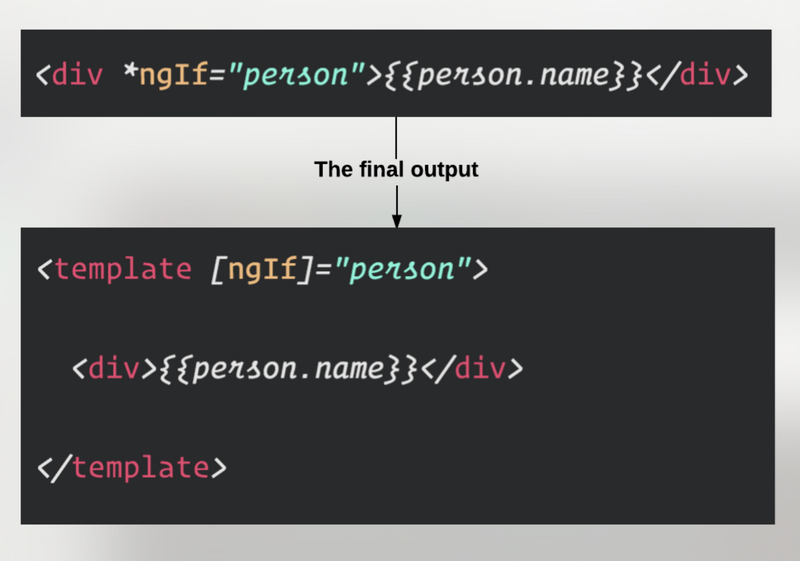

# 结构指令

结构指令通过添加和删除DOM元素来更改DOM布局。Angular中 2 个常见的结构指令是`*ngIf`和`*ngFor`。

## *号语法

`*`号是语法糖，用于避免使用复杂的语法。以`*ngIf`指令为例：



- Angular 把 host（宿主元素）包装在 `ng-template` 标签里面。
- Angular 将 `ngIf`转换为属性绑定`[ngIf]`。

## 指令定义

*src\app\app.component.html*

```html
<h4>Your age:</h4>
<select>
  <ng-container *range="[18, 80]; let num">
    <option [value]="num">{{ num }}</option>
  </ng-container>
</select>

<h4>Year:</h4>
<select>
  <ng-container *range="[1980, 2020]; let num">
    <option [value]="num">{{ num }}</option>
  </ng-container>
</select>

```

*src\app\directives\range.directive.ts*

```typescript
import { Directive, Input, ViewContainerRef, TemplateRef } from '@angular/core';

@Directive({
  // tslint:disable-next-line:directive-selector
  selector: '[range]'
})
export class RangeDirective {

  // tslint:disable-next-line:variable-name
  _range: number[];

  @Input() set range(value: number[]) {
    this.vcr.clear();
    this._range = this.generateRange(value[0], value[1]);
    this._range.forEach(num => {
      this.vcr.createEmbeddedView(this.tpl, { $implicit: num });
    });
  }

  constructor(
    private vcr: ViewContainerRef,
    private tpl: TemplateRef<any>
  ) { }

  private generateRange(from: number, to: number) {
    const numbers: number[] = [];
    for (let i = from; i <= to; i++) {
      numbers.push(i);
    }
    return numbers;
  }
}

```

### $implicit

Angular 提供了`let`模板语法，允许在生成上下文时定义和传递上下文。当调用`createEmbeddedView`创建模板时，`let-{name}`可以传递在`ng-template`中使用的上下文，并且使用键`$implicit`设置上下文对象中的默认值。

例如：

```js
vcRef.createEmbeddedView(template, { $implicit: 'value' })
```

```html
<ng-template let-foo>
    {{ foo }}
</ng-template>
```

相当于：

```html
<ng-template let-foo="$implicit">
    {{ foo }}
</ng-template>
```

如果不使用`$implicit`，则需要这样写：

```js
vcRef.createEmbeddedView(template, { m: 'value' })
```

```html
<ng-template let-foo="m">
    {{ foo }}
</ng-template>
```

