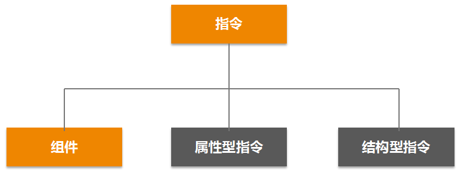
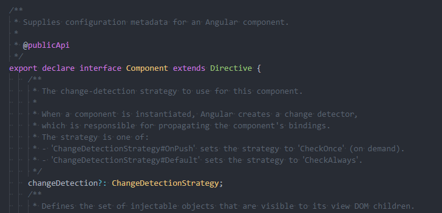

# 自定义指令

组件与指令之间的关系

Angular 里面有 3 种类类型的指令：

- **Component** 是 Directive 的子接口，是一种特殊的指令，Component 可以带有 HTML 模板，Directive 不能有模板。
- **属性型指令**：用来修改 DOM 元素的外观和行为，但是不会改变 DOM 结构，Angular 内置指令里面典型的属性型指令有 ngClass、ngStyle。如果你打算封装自己的组件库，属性型指令是必备的内容。
- **结构型指令**：可以修改 DOM 结构，内置的常用结构型指令有 *ngFor、*ngIf 和 NgSwitch。由于结构型指令会修改 DOM 结构，所以同一个 HTML 标签上面不能同时使用多个结构型指令，否则大家都来改 DOM 结构，到底听谁的呢？如果要在同一个 HTML 元素上面使用多个结构性指令，可以考虑加一层空的元素来嵌套，比如在外面套一层空的`<ng-container></ng-container>`，或者套一层空的`
`。