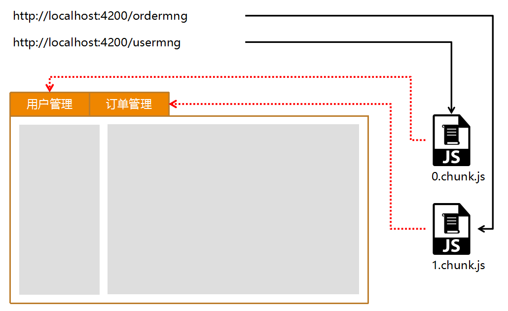
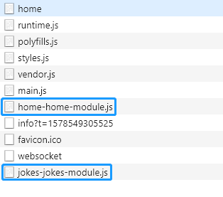

# 路由与懒加载模块



> 为什么要做模块的懒加载？

目的很简单：提升 JS 文件的加载速度，提升 JS 文件的执行效率。

对于一些大型的后台管理系统，可能会有上千份 JS 文件，如果把所有 JS 全部都压缩对一份文件里，这份文件的体积可能会超过 5M，这是不能接受的，尤其对于移动端应用。

所以，按照业务功能，把这些 JS 打包成多份 JS 文件，当用户导航到某一个路径的时候，再去异步加载对应的 JS 文件。这种方式非常有效地提升系统的加载和运行效率。

*src\app\app-routing.module.ts*

```typescript
import { NgModule } from '@angular/core';
import { Routes, RouterModule } from '@angular/router';


const routes: Routes = [
  { path: '', redirectTo: 'home', pathMatch: 'full' },
  { path: 'home', loadChildren: './home/home.module#HomeModule' },
  { path: 'jokes', loadChildren: './jokes/jokes.module#JokesModule' },
  { path: '**', loadChildren: './home/home.module#HomeModule' }
];

@NgModule({
  imports: [RouterModule.forRoot(routes)],
  exports: [RouterModule]
})
export class AppRoutingModule { }
```

 

注意：从 Angular8.0 开始，为了遵守最新的 import() 标准，官方建议采用新的方式来写`loadChildren`：

```typescript
// before Angular 8.x
const routes: Routes = [
  { path: 'home', loadChildren: './home/home.module#HomeModule' },
  { path: 'jokes', loadChildren: './jokes/jokes.module#JokesModule' },
  { path: '**', redirectTo: 'home', pathMatch: 'full' }
];

// Angular 8.x
const routes: Routes = [
  { path: 'home', loadChildren: () => import('./home/home.module').then(m => m.HomeModule) },
  { path: 'jokes', loadChildren: () => import('./jokes/jokes.module').then(m => m.JokesModule) },
  { path: '**', redirectTo: 'home', pathMatch: 'full' },
];

```

