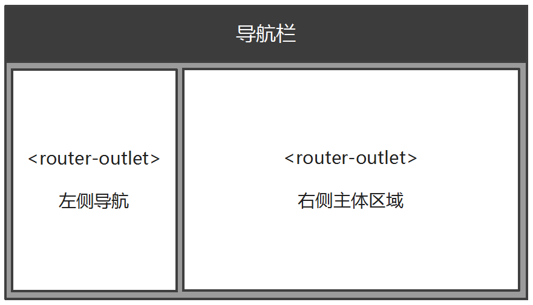

# 多重出口

有时候我们在同一个界面上需要同时出现多块动态的内容，如图：



## app

*src\app\app.component.html*

```html
<a [routerLink]="['home', { outlets: { 'left-nav': ['leftNav'], 'main-area': ['1'] } }]">Home</a>
```

*src\app\app-routing.module.ts*

```typescript
import { NgModule } from '@angular/core';
import { Routes, RouterModule } from '@angular/router';
import { HomeComponent } from './home/home.component';
import { LeftNavComponent } from './home/left-nav/left-nav.component';
import { MainAreaComponent } from './home/main-area/main-area.component';


const routes: Routes = [
  {
    path: 'home',
    component: HomeComponent,
    children: [
      { path: 'leftNav', component: LeftNavComponent, outlet: 'left-nav' },
      { path: ':id', component: MainAreaComponent, outlet: 'main-area' }
    ]
  },
  { path: '**', redirectTo: 'home' }
];

@NgModule({
  imports: [RouterModule.forRoot(routes)],
  exports: [RouterModule]
})
export class AppRoutingModule { }

```

## main-area

*src\app\home\main-area\main-area.component.html*

```html
<h3>
  {{ menuName }}
</h3>

```

*src\app\home\main-area\main-area.component.ts*

```typescript
import { Component, OnInit } from '@angular/core';
import { ActivatedRoute } from '@angular/router';

@Component({
  selector: 'app-main-area',
  templateUrl: './main-area.component.html',
  styleUrls: ['./main-area.component.scss']
})
export class MainAreaComponent implements OnInit {

  menuName = 'No menu selected';

  constructor(private route: ActivatedRoute) { }

  ngOnInit() {
    this.route.params.subscribe((params: { id: string }) => {
      console.log(`Current Menu ID : ${ params.id }`);
      if (params.id === '1') {
        this.menuName = 'Look at the picture.';
      } else {
        this.menuName = 'Look at the text.';
      }
    });
  }

}

```

## left-nav

*src\app\home\left-nav\left-nav.component.html*

```typescript
<div class="list-group">
  <a href="javascript:void(0);" class="list-group-item active">Choose a menu</a>
  <a class="list-group-item" (click)="toogle(1)">look at the picture</a>
  <a class="list-group-item" (click)="toogle(2)">look at the text</a>
</div>

```

*src\app\home\left-nav\left-nav.component.ts*

```typescript
import { Component, OnInit } from '@angular/core';
import { Router } from '@angular/router';

@Component({
  selector: 'app-left-nav',
  templateUrl: './left-nav.component.html',
  styleUrls: ['./left-nav.component.scss']
})
export class LeftNavComponent implements OnInit {

  constructor(private router: Router) { }

  ngOnInit() {
  }

  toogle(id) {
    this.router.navigate(['/home', { outlets: { 'main-area': [id] } }]);
  }
}

```

